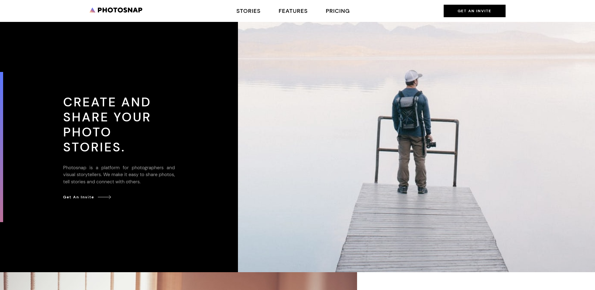

### Image Focused Multi Page Website

### Links

- [solution](https://www.frontendmentor.io/solutions/photography-page-using-react-m8OuzfOEuZ)
- [live site](https://glittery-cocada-f721be.netlify.app/)

## My process

### Built with

- vite
- react

### What I learned

Since this was one of the bigger projects I have learned a lot about organising files and assets, as well as using shared React components. 

### Continued development

I would like to add some page transitions and animations to this site in the future and maybe refactor some CSS classes and night mode. 
